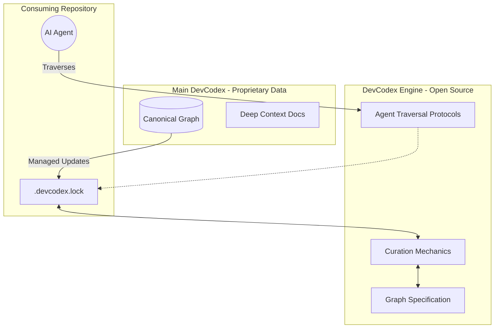

# DevCodex Engine

DevCodex Engine is the open-source infrastructure for building, curating, and deploying AI-first knowledge graphs. It bridges the gap between human engineering wisdom and autonomous AI execution by replacing static documentation with traversable, high-signal rules and patterns.

While Large Language Models possess broad generalized capabilities, they lack deterministic alignment with an organization's specific architectural and security boundaries. DevCodex solves this by defining engineering knowledge as crisp nodes and typed edges, allowing AI agents to instantly align with precise project contexts before writing a single line of code.

## Architecture Overview

DevCodex separates the open-source retrieval machinery (the Engine) from the proprietary global intelligence (Main DevCodex).

## Core Capabilities

- **Deterministic Knowledge Graphs**: Knowledge is stored as atomic nodes connected by typed edges (`part-of`, `depends-on`, `implements`). Agents pull only what they need based on exact task context.
- **Authority Scoping**: Every node explicitly declares its authority (`rule`, `recommendation`, or `principle`). The engine augments agent reasoning rather than blindly biasing it.
- **Project-Level Curation**: Using `.devcodex.lock`, projects pull and freeze specific sub-graphs, ensuring reproducible AI behavior locally while maintaining upstream freshness.
- **Agent-First Traversal**: Optimized for autonomous LLMs. The engine prevents context-window bloat by providing high-signal telemetry instead of walls of prose, leaving deep documentation strictly for on-demand elaboration.

## Open Source vs. Commercial Boundary

To ensure DevCodex can operate at a global scale while remaining commercially sustainable, the system boundaries are strictly defined:

1. **DevCodex Engine (This Repository)**: 100% open-source. Includes all graph schemas, agent traversal mechanics, local state management, and validation tooling. You are free to build, host, and traverse your own proprietary knowledge graphs using this engine.
2. **DevCodex Foundation (Proprietary)**: The canonical global database of security practices, production standards, and architectural patterns. Access to the managed global intelligence layer is provided via a commercial subscription.

## Getting Started

*(Instructions for initializing the engine and linking to a knowledge graph will be documented here as core tooling is released.)*

## Specifications & Guidelines

- **Graph Schema Definition**: `graph/schema.md`
- **Agent Traversal Protocol**: `AGENTS.md`
- **Project Curation Mechanics**: `CURATION.md`

---
*DevCodex Engine — Standardizing how AI builds software.*
